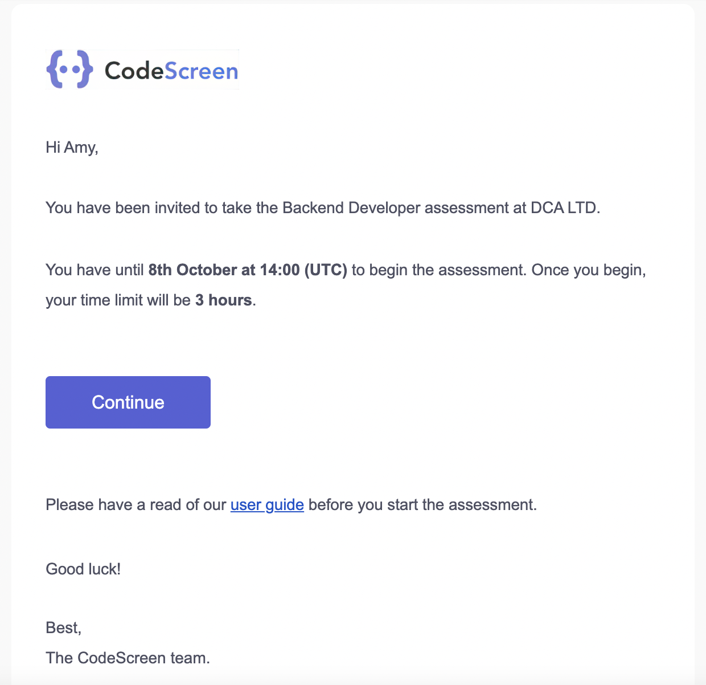
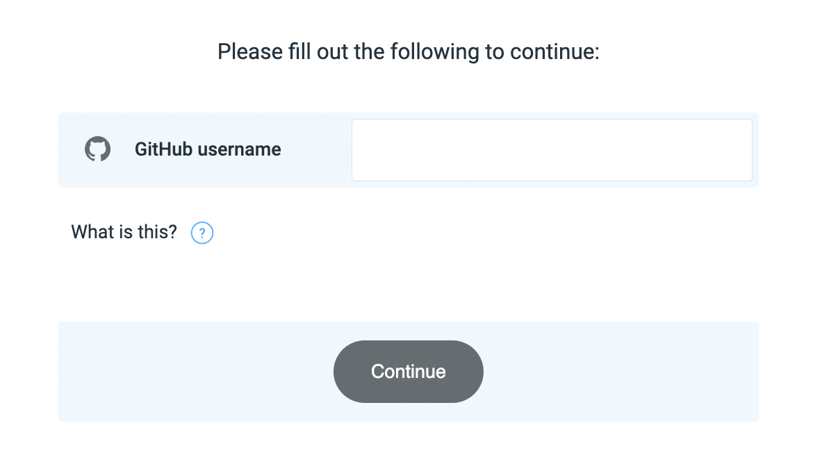
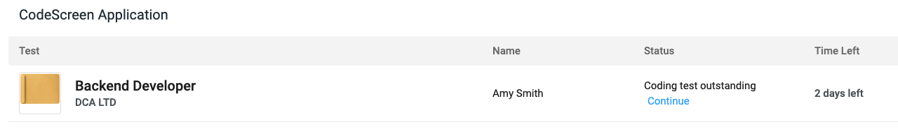
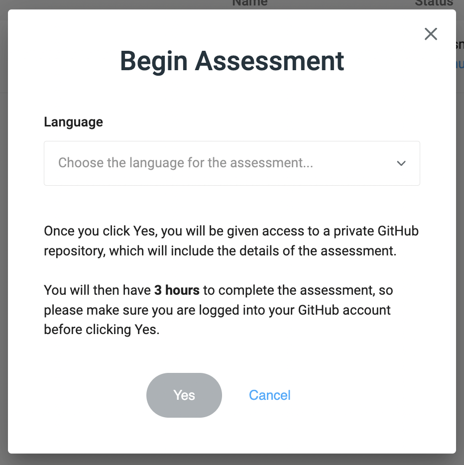
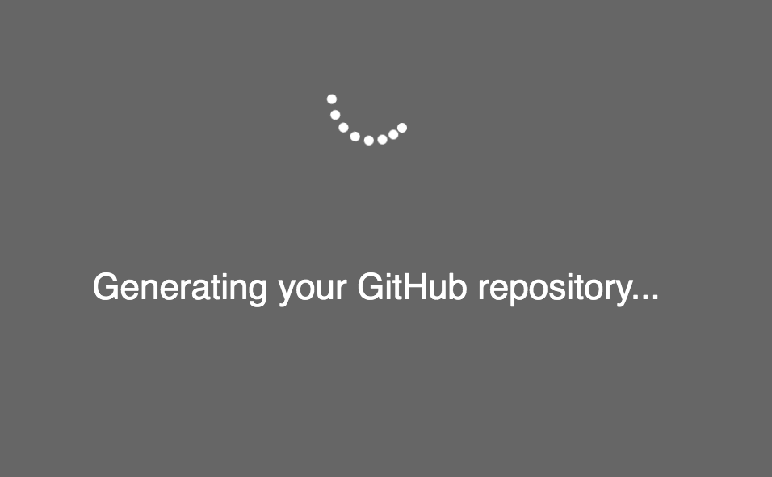
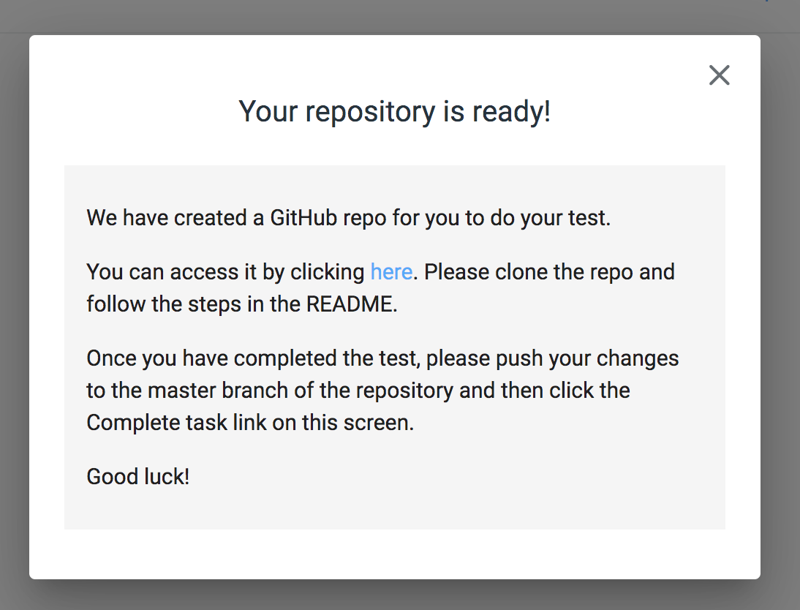
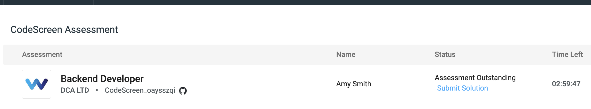

# Begin Test

To kick things off, you will receive an email similar to the following:

 

<figure>
  <figcaption style="font-style: italic; font-weight: bold">Begin Test Email:</figcaption>
   
  
</figure>

 

Once you click the `Click here to continue` blue button, you will be brought to the initial sign up screen. **Note** your 
timer does not start at this point.

 

<figure>
  <figcaption style="font-style: italic; font-weight: bold">Sign Up Screen:</figcaption>
   
  
</figure>

 

You will just need to enter your `GitHub` username, and then click the `Continue` button to proceed.

You will now see a screen similar to the following:

 

<figure>
  <figcaption style="font-style: italic; font-weight: bold">Begin Task:</figcaption>
   
  
</figure>

 

Please click the `Begin task` link. You will then see a pop-up similar to the following:

 

<figure>
  <figcaption style="font-style: italic; font-weight: bold">Begin Task Pop-Up:</figcaption>
   
  
</figure>

 

Here you can choose the language/framework in which to write your solution.

Once you click the `Yes` button, we will generate a new repository for you on GitHub, and the timer will start. So, please
make sure you are ready to start working on the test at this point.

 

<figure>
  <figcaption style="font-style: italic; font-weight: bold">Generating Repo:</figcaption>
   
  
</figure>

 

<figure>
  <figcaption style="font-style: italic; font-weight: bold">Generating Repo Complete:</figcaption>
   
  
</figure>

 

Please click on the link shown in the pop-up image above, which will bring you to your repository on GitHub.  
**Note** that if you see a `404 Error` on GitHub at this point, please follow these <a href="#404Error.md">instructions</a>.

Once you exit out of the pop-up, you will see the `countdown timer` on the right. This represents the amount of time you have
left to complete the assessment. The link to your GitHub repo will also always be available on this screen:

<figure>
  <figcaption style="font-style: italic; font-weight: bold"></figcaption>
   
  
</figure>

You can now <a href="#cloningRepo.md">clone your repo</a> locally, and start working on the assessment inside your code editor of choice.
