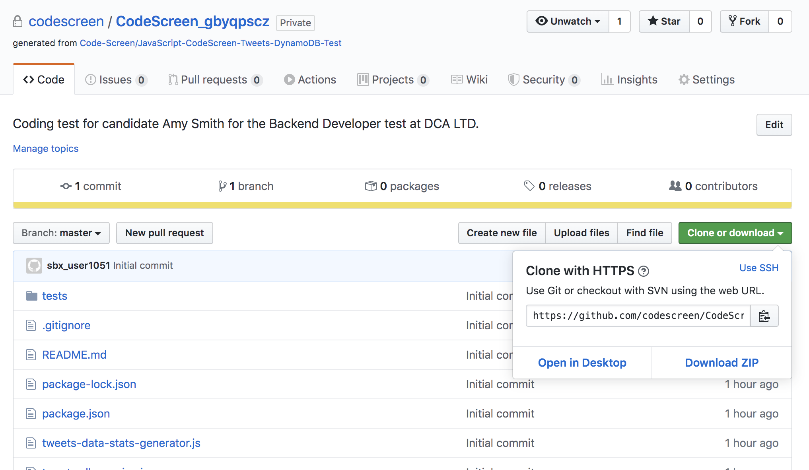

# Cloning Repo

Once you follow the link to your repo on `GitHub`, you will see a screen similar to the following:

<figure>
  <figcaption style="font-style: italic; font-weight: bold">GitHub Repository:</figcaption>
   
  
</figure>

 

The repository that is created for you is `private`, meaning only you have access to it. The repository contains
the contents of the assessment.

The `README` in the repository will contain the instructions for the test.

To clone your repo, you will first need to <a href="https://git-scm.com/book/en/v2/Getting-Started-Installing-Git" target="_blank">
install Git</a> on your computer.

You can now clone the repo locally, either over `HTTPS` or `SSH`. If you are not familiar with this process, please see
<a href="https://help.github.com/en/github/creating-cloning-and-archiving-repositories/cloning-a-repository" target="_blank">these instructions</a>.

Once you clone your repo, the next step is to <a href="#pushingChanges.md">push the changes</a> you make up to your repository.