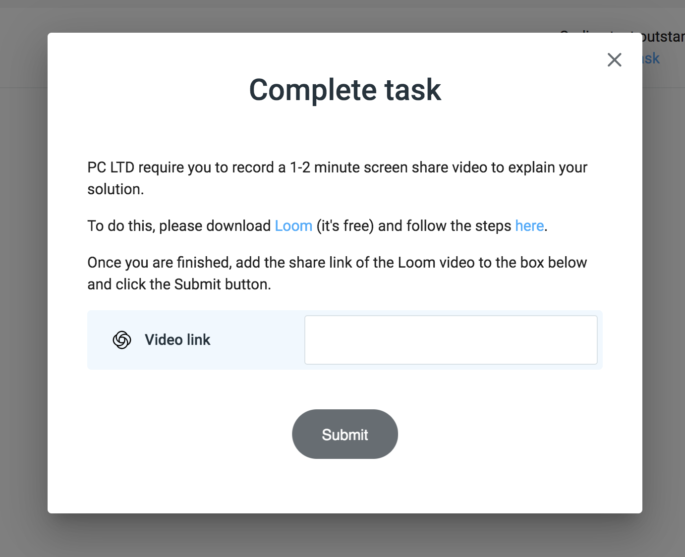
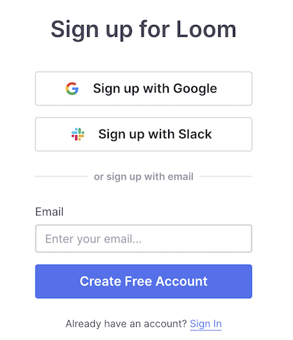
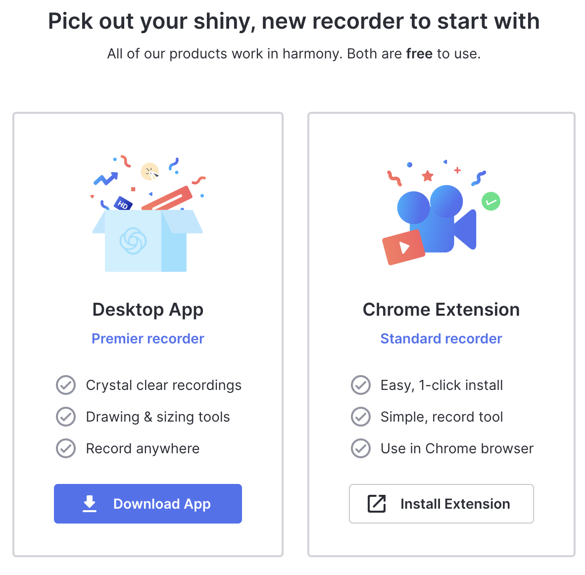

# Getting Started

### Introduction
Some companies using CodeScreen require candidates to record a quick screen share walkthrough video to give an overview of your solution. Here you can talk about the approach you took to solving your CodeScreen assessment while walking through your code.

You will know whether or not you are required to record a video depending on which pop up screen appears when you click 
the `Complete task` link.

If you are **required** to record a video, you will see this pop up:

<figure>
  <figcaption style="font-style: italic; font-weight: bold"></figcaption>
   
  
</figure>

If you are **not required** to record a video, you will see this pop up:

<figure>
  <figcaption style="font-style: italic; font-weight: bold"></figcaption>
   
  
</figure>

### Downloading Loom

The platform we use for recording videos is called [`Loom`](https://www.loom.com). Loom is a video communication tool, trusted by thousands of companies worldwide. It's completely free and straightforward & intuituve to use. 

To download Loom, head over to the sign up section [`here`](https://www.loom.com/signup). 

<figure>
  <figcaption style="font-style: italic; font-weight: bold">Loom sign up:</figcaption>
   
  
</figure>

 

Once you sign up, you will be given the option to download the `Desktop App` or install the `Chrome Extension`. 

<figure>
  <figcaption style="font-style: italic; font-weight: bold">Loom download:</figcaption>
   
  
</figure>

It is preferred to download the `Desktop App` so you can show your `IDE` when explaining your code, but the `Desktop App` is not currently available for `Linux`.  
So if you are using `Mac` or `Windows`, please download the Desktop App, otherwise install the `Chrome Extension` and show your code on `GitHub` instead of in your `IDE`.

Click [`here`](https://support.loom.com/hc/en-us/articles/360002179357-Install-the-Loom-Desktop-App-) for instructions on setting up the `Desktop App`.

Click [`here`](https://support.loom.com/hc/en-us/articles/360002177497-Install-the-Chrome-Extension) for instructions on setting up the `Chrome Extension`.

Once you have Loom set up, it's time to <a href="#record">record the video</a>.