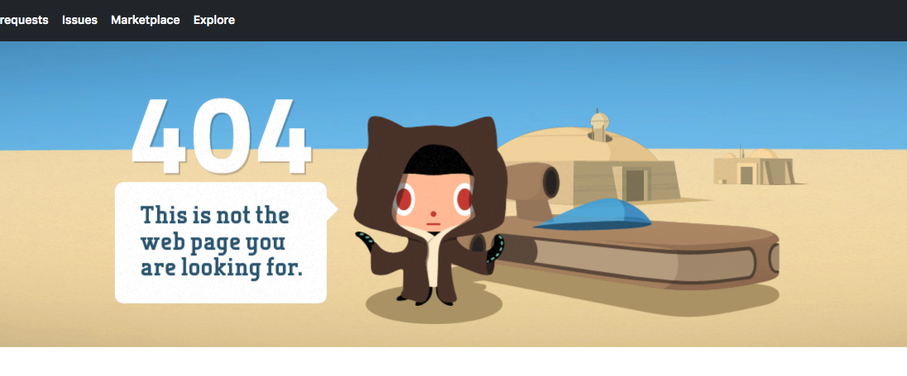

# GitHub 404 Error

When a start your CodeScreen assessment, we generate a private repository for you on [`GitHub`](https://github.com/) and give the username (which you specified when beginning the assessment) access to this repository.

When you click on the repository link URL, you may see the following:

<figure>
  <figcaption style="font-style: italic; font-weight: bold">GitHub 404 Error:</figcaption>
   
  
</figure>

The reason for this is that you are either not currently logged into `GitHub`, or logged in under a different username than the one you specified when beginning the assessment.

To solve this issue, please log into `GitHub` using the username you specified when beginning the assessment and click the repo link again.

If you have mistakenly entered a `GitHub` username that does not belong to you, message us on our live chat below with
the username   you want to grant access to and we will update it for you.