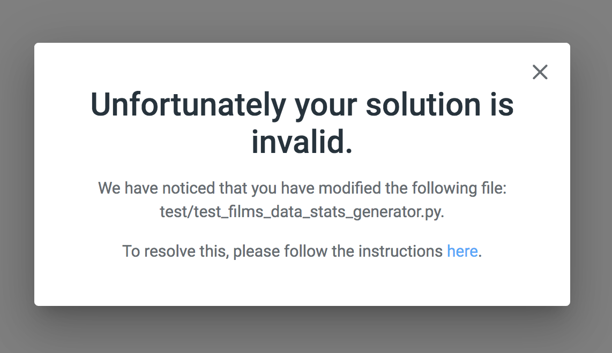
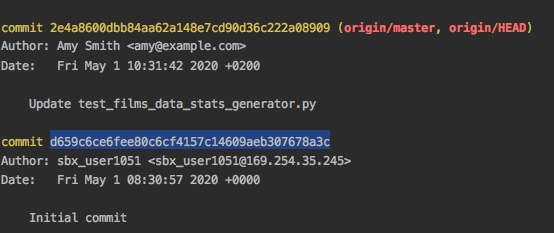
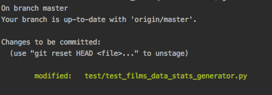

# Solution Invalid - Test file has been modified

When you start your CodeScreen assessment, you will see a message stating that the existing unit test files must not be modified.

Sometimes, however, these files may be changed without you explicitly modifying them, e.g., your IDE adds extra tab space, etc.

If one of these test files change, and you commit this change, you will then see the following message when you submit your solution:

<figure>
  <figcaption style="font-style: italic; font-weight: bold">Invalid Solution Error:</figcaption>
  </br>
  
</figure>

To resolve this issue, please follow the steps below:

**1.**

Checkout the version of the unit test file that has been changed (the file that is displayed in the error message). <br>You can do this by running the following command
(assuming the hash of the `Initial Commit` is `d659c6ce6fee80c6cf4157c14609aeb307678a3c`, and the test file that has been changed is `test/test_films_data_stats_generator.py`):

```
git checkout d659c6ce6fee80c6cf4157c14609aeb307678a3c -- test/test_films_data_stats_generator.py
```

The hash above is the hash of the `Initial Commit` commit of your repository. You can retrieve this for your repository by running the following command:

```
git log
```

and then looking at the hash of the `Initial Commit` commit:

<figure>
  <figcaption style="font-style: italic; font-weight: bold"></figcaption>
  </br>
  
</figure>

**2.** 

Now run

```
git status
```

and you will see the change in the staging area:

<figure>
  <figcaption style="font-style: italic; font-weight: bold"></figcaption>
  </br>
  
</figure>

To commit the change, run

```
git commit -m "Reverting test file change"
```

**3.**

Finally, run

```
git push
```
<br>

That's it; you're all set! You will now be able to submit your solution by clicking the `Submit Solution` link again.
