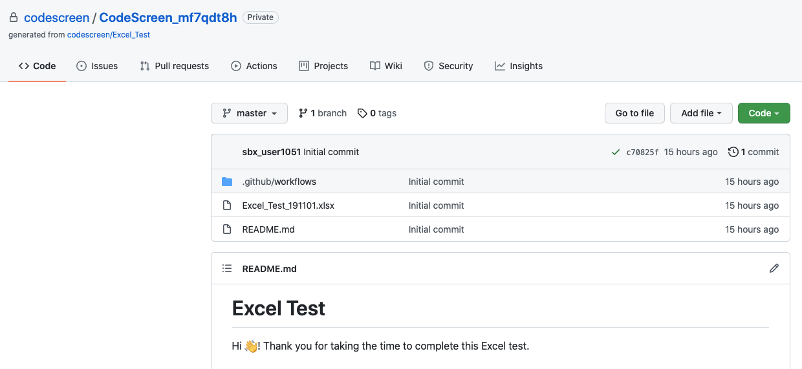
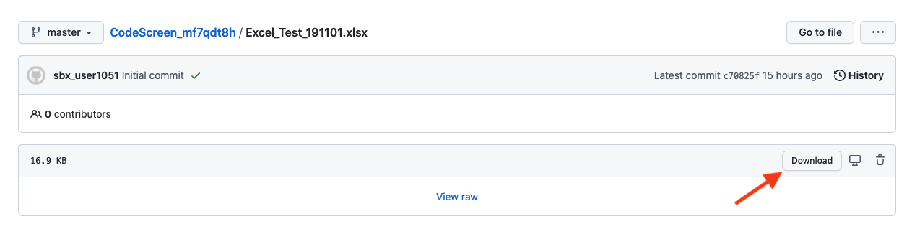
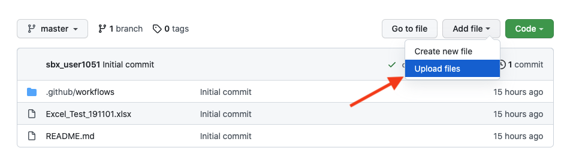
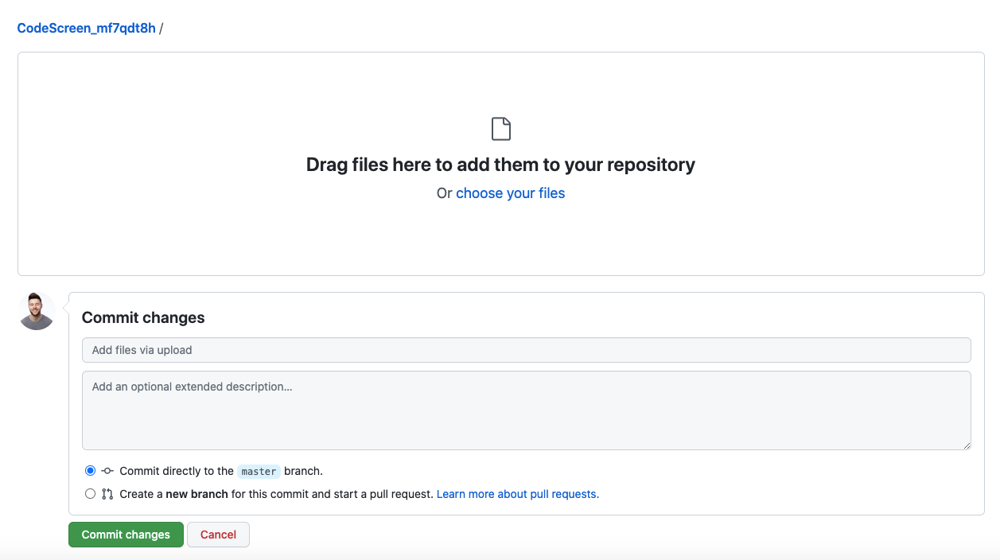
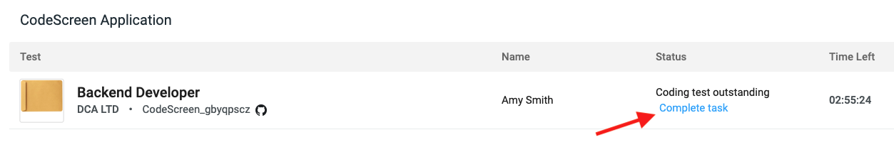

# Non-Tech Workflow

Some CodeScreen customers also use our platform to send out assessments that are not developer-based, such as Excel tests, etc.

For these types of tests, the workflow still requires the use of `GitHub` (and therefore, a GitHub account is needed) but does not require you to have any software installed locally to take the test and submit your solution.

### Prerequisites

* <a href="https://www.github.com" target="_blank">GitHub</a> - GitHub is a web-based, version control system. It provides a place for developers to host and share their projects. However, nothing is requiring the documents stored in GitHub to be programming code, which is why it's becoming popular for non-developers to use it to store all kinds of files, such as Excel spreadsheets, etc.

The CodeScreen workflow requires you to have a GitHub account set up, and you can create an account <a href="https://www.github.com" target="_blank">here</a> for free in under 1 minute.

### Workflow

To kick things off, you will receive an email similar to the following:

<figure>
  <figcaption style="font-style: italic; font-weight: bold">Begin Test Email:</figcaption>
   
  
</figure>

 

Once you click the `Click here to continue` blue button, you will be brought to the initial sign-up screen. **Note** your 
timer does not start at this point.

 

<figure>
  <figcaption style="font-style: italic; font-weight: bold">Sign Up Screen:</figcaption>
   
  
</figure>

 

You will just need to enter your `GitHub` username (which you will have after creating a GitHub account) and then click the `Continue` button to proceed.

You will now see a screen similar to the following:

 

<figure>
  <figcaption style="font-style: italic; font-weight: bold">Begin Task:</figcaption>
   
  
</figure>

 

Please click the `Continue` link. You will then see a pop-up similar to the following:

 

<figure>
  <figcaption style="font-style: italic; font-weight: bold">Begin Task Pop-Up:</figcaption>
   
  
</figure>

 

Here you can choose the language/framework in which to write your solution.

Once you click the `Yes` button, we will generate a new repository for you on GitHub, and the **timer will start**. So, please
make sure you are ready to start working on the test at this point.

 

<figure>
  <figcaption style="font-style: italic; font-weight: bold">Generating Repo:</figcaption>
   
  
</figure>

 

<figure>
  <figcaption style="font-style: italic; font-weight: bold">Generating Repo Complete:</figcaption>
   
  
</figure>

 

Please click on the link shown in the pop-up image above, which will bring you to your `repository (repo)` on GitHub. A repository can be thought of as a folder on your computer containing files that only you have access to.

You can ignore the "clone the repo" line in the screenshot above as you will be submitting your files to your repo directly on GitHub (rather than locally from your computer).

**Note** that if you see a `404 Error` on GitHub at this point, please follow these <a href="#404Error.md">instructions</a>.

Once you exit out of the pop-up, you will see the `countdown timer` on the right. This represents the amount of time you have
left to complete the assessment. The link to your GitHub repo will also always be available on this screen:

<figure>
  <figcaption style="font-style: italic; font-weight: bold"></figcaption>
   
  
</figure>

 

Your GitHub repo will look similar to the following:

<figure>
  <figcaption style="font-style: italic; font-weight: bold"></figcaption>
   
  
</figure>

 

You can then download the file(s) you need to modify as part of the assessment to your computer:

<figure>
  <figcaption style="font-style: italic; font-weight: bold"></figcaption>
   
  
</figure>

 

When you have made all your changes to the file(s) and are ready to submit them, you can upload them directly to your
GitHub repo:

<figure>
  <figcaption style="font-style: italic; font-weight: bold"></figcaption>
   
  
</figure>

 

Once the files have been uploaded, you can then hit the green `Commit changes` button on the bottom left to save the changes.

<figure>
  <figcaption style="font-style: italic; font-weight: bold"></figcaption>
   
  
</figure>

 

Finally, then just hit the `Complete task` link on the application screen to submit your solution:

<figure>
  <figcaption style="font-style: italic; font-weight: bold"></figcaption>
   
  
</figure>

And that's it!
