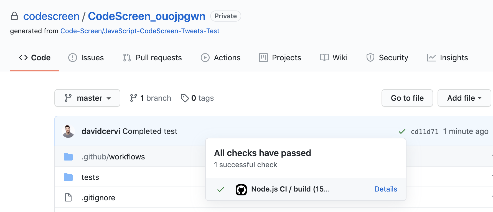
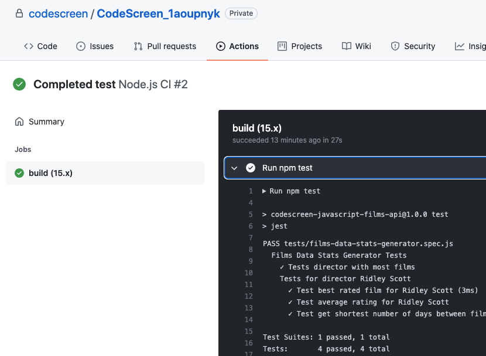

# Pushing Changes

In order to be able to submit your solution, you need to push your work up to the `main` branch of your repository.

To do this, please run the following commands inside the directory of the repo you cloned locally:

```
git add *
git commit -m "Commit message here"
git push

```

You may also commit and push your changes using a `GitHub GUI`, such as <a href="https://desktop.github.com/" target="_blank">Github Desktop</a>
or <a href="https://www.sourcetreeapp.com/" target="_blank">Sourcetree</a>.

**Note** that you can commit in small chunks if you like as you can push one or more commits to your repo. 

You may also push your changes to a separate branch, but be aware that each branch you create **must** be merged to `main` before you submit your solution,
as we run our analysis on your code that is in the `main` branch of your repo.

### GitHub Actions

Each time you push a new commit to your GitHub repo, a <a href="https://github.com/features/actions" target="_blank">GitHub Action</a> will automatically run that builds and tests your solution against all the unit cases inside your repo.

You can then view the result of the build directly in GitHub:

<figure>
  <figcaption style="font-style: italic; font-weight: bold">Example GitHub Action result:</figcaption>
  </br>
  
</figure>

<br>

<figure>
  <figcaption style="font-style: italic; font-weight: bold">Example GitHub Action result details:</figcaption>
  </br>
  
</figure>

<br>

**Note** you can also build and test your solution locally. Your repo's `README` and `.github/workflows/*.yml` file will contain the commands that you need to execute to run your solution locally.

Once you have pushed your first commit to `main`, you will be able to <a href="#submittingSolution.md">submit your solution</a>.
