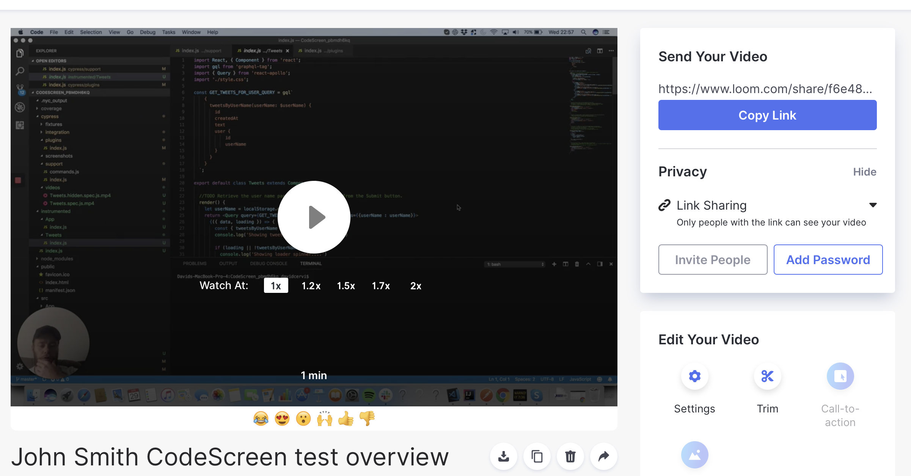
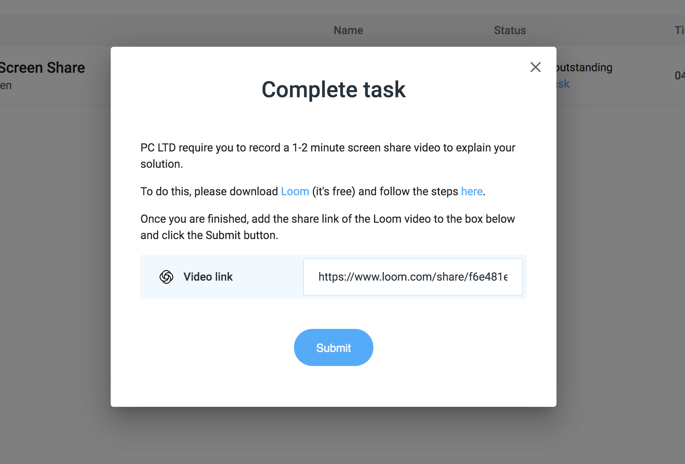

# Submitting video

Once you have finished recording a video, it will be automatically saved to your `Loom` account.

<figure>
  <figcaption style="font-style: italic; font-weight: bold">Loom video:</figcaption>
   
  
</figure>

  
To submit your video, first click the `Copy Link` blue button on the right hand side of the video to copy the link to your clipboard.

**Note** - Please don't add a password to the video. Don't worry, nobody else other than the company you are applying to will be able to view your video.

Once you have the link copied, head back to the and paste the link into the `Video link` box and click the `Submit` button.

<figure>
  <figcaption style="font-style: italic; font-weight: bold">Submit solution:</figcaption>
   
  
</figure>

 

That's it. You're all done!
