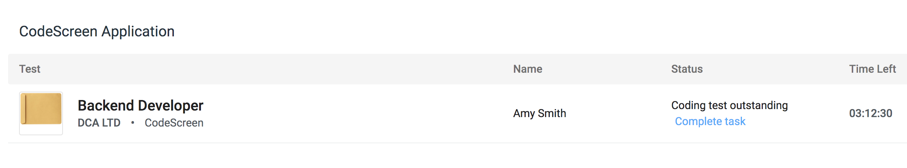
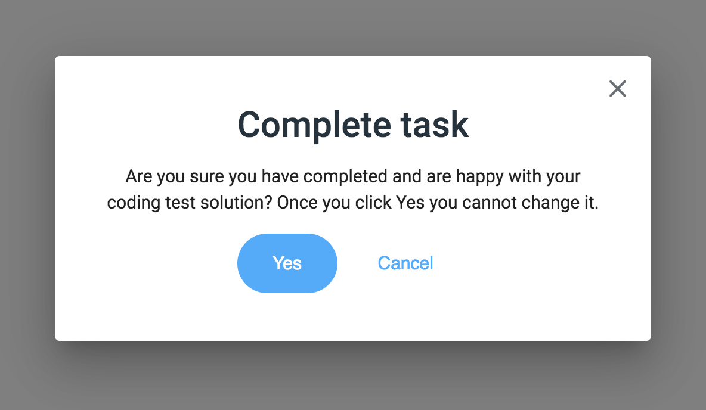

# Submitting Solution

Once you are happy with your solution, you can now submit it by clicking the `Complete task` on the `Application screen`:

<figure>
  <figcaption style="font-style: italic; font-weight: bold">Application Screen:</figcaption>
   
  
</figure>

<figure>
  <figcaption style="font-style: italic; font-weight: bold">Complete Task Confirmation:</figcaption>
   
  
</figure>

 

**Important** - Once you submit your solution, you will not be able to change it, so please make sure you are happy
with it before doing so.

Once you click the `Yes` button, you will receive an email confirming receipt of your solution.

And that's it. The company you are applying to will then be in touch with an update on your application. Good luck!
